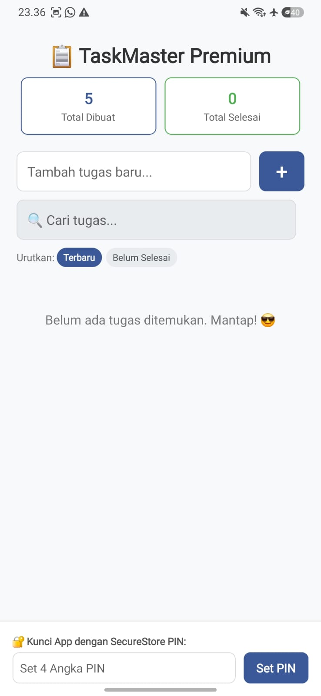
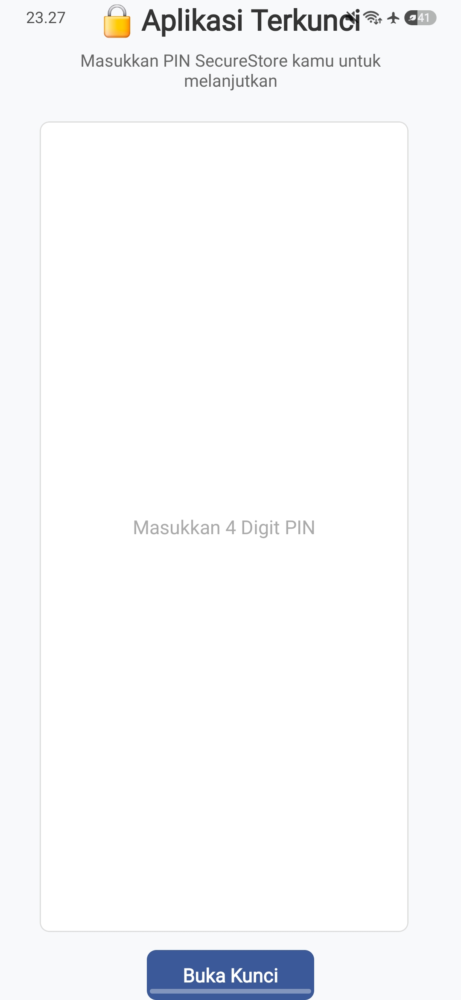

# 📋 TaskMaster Premium - Aplikasi Manajemen Tugas Berbasis React Native

TaskMaster Premium adalah aplikasi manajemen tugas (*Task Management*) yang dikembangkan menggunakan **React Native** dan **Expo**. Aplikasi ini menerapkan konsep **CRUD (Create, Read, Update, Delete)** dengan **persistensi data lokal menggunakan AsyncStorage**, sehingga seluruh data tugas tetap tersimpan meskipun aplikasi ditutup atau perangkat dimatikan.

Selain fitur CRUD dasar, aplikasi ini juga dilengkapi dengan fitur pengembangan seperti pencarian tugas, statistik produktivitas, pengurutan data, serta sistem keamanan menggunakan **SecureStore PIN Protection**.

---

# ✨ Fitur Aplikasi

## 🟢 Level 1 — Fitur Wajib (Core)

### ➕ Create

* Menambahkan tugas baru melalui `TextInput`.
* Validasi input untuk mencegah tugas kosong.
* Menampilkan `Alert` jika pengguna mencoba menambahkan tugas tanpa isi.

### 📖 Read

* Memuat seluruh data tugas secara otomatis saat aplikasi dibuka.
* Menggunakan `useEffect`, `AsyncStorage`, dan `JSON.parse()`.

### ❌ Delete

* Menghapus tugas secara individual dari daftar.
* Data langsung disinkronkan ke penyimpanan lokal setelah penghapusan.

### 💾 Persistensi Data

* Data disimpan menggunakan `AsyncStorage`.
* Menggunakan `JSON.stringify()` saat menyimpan dan `JSON.parse()` saat memuat data.
* Data tetap tersedia setelah aplikasi ditutup dan dibuka kembali.

### 📋 FlatList Rendering

* Menampilkan daftar tugas menggunakan `FlatList`.
* Menggunakan `keyExtractor` untuk optimasi performa rendering.

### 😎 Empty State

* Menampilkan pesan ketika belum terdapat tugas yang tersimpan.

---

## 🟡 Level 2 — Fitur Pengembangan

### ✅ Update Status Tugas

* Ketuk tugas untuk mengubah status selesai atau belum selesai.
* Tugas yang selesai akan ditandai dengan ikon centang (✅).
* Teks tugas otomatis dicoret (*line-through*).

### 📊 Statistik Produktivitas

Menampilkan statistik secara real-time:

* Total tugas dibuat.
* Total tugas selesai.

Data statistik disimpan pada key terpisah di `AsyncStorage` sehingga tidak hilang saat aplikasi dimuat ulang.

### 🔍 Pencarian Tugas

* Mencari tugas berdasarkan kata kunci.
* Filtering dilakukan secara langsung pada data yang ada di memori.

### 🗑️ Konfirmasi Hapus

* Menampilkan dialog konfirmasi sebelum tugas dihapus.

### 🧹 Hapus Semua Tugas

* Menghapus seluruh daftar tugas sekaligus.
* Tidak menggunakan `AsyncStorage.clear()` sehingga key lain tetap aman.

---

## 🔴 Level 3 — Tantangan Bonus

### 🔀 Dynamic Sorting

Pengguna dapat mengurutkan daftar tugas berdasarkan:

* **Terbaru** → tugas terbaru muncul di bagian atas.
* **Belum Selesai** → tugas yang belum selesai diprioritaskan tampil lebih dahulu.

### 🕒 Timestamp Tugas

* Setiap tugas menyimpan waktu pembuatan (`createdAt`).
* Waktu ditampilkan pada setiap item tugas.

### 🔐 SecureStore PIN Protection

* Menggunakan `expo-secure-store` untuk menyimpan PIN secara aman.
* Pengguna dapat membuat PIN untuk mengunci aplikasi.
* Setelah PIN dibuat, aplikasi akan meminta PIN setiap kali dibuka kembali.
* Tersedia fitur reset PIN untuk menghapus proteksi aplikasi.

---

# 🛠️ Teknologi yang Digunakan

| Teknologi        | Kegunaan                     |
| ---------------- | ---------------------------- |
| React Native     | Pengembangan aplikasi mobile |
| Expo SDK 54      | Framework React Native       |
| AsyncStorage     | Penyimpanan data lokal       |
| Expo SecureStore | Penyimpanan PIN secara aman  |
| React Hooks      | State Management & Lifecycle |

---

# 📱 Bukti Implementasi

| Dashboard                   | Set PIN                 | Lock Screen                     |
| --------------------------- | ----------------------- | ------------------------------- |
|  |  |  |

**Keterangan:**

* **Dashboard** menunjukkan daftar tugas, statistik, dan fitur CRUD.
* **Set PIN** menunjukkan proses pembuatan PIN keamanan.
* **Lock Screen** menunjukkan aplikasi yang terkunci dan meminta PIN sebelum dapat diakses.

---

# 🚀 Cara Menjalankan Proyek

## 1. Clone Repository

```bash
git clone LINK_GITHUB_KAMU
cd TaskMaster54
```

## 2. Install Dependency

```bash
npm install
```

## 3. Jalankan Expo

```bash
npx expo start
```

## 4. Jalankan pada Perangkat

* Scan QR Code menggunakan aplikasi **Expo Go**.
* Atau jalankan menggunakan emulator Android/iOS.

---

# 🔗 Link Proyek

**GitHub Repository:**
https://github.com/riskensitorus/pertemuan12.git

**Expo Snack:**
https://snack.expo.dev/@risken192/pertemuan12

---

# 🎯 Hasil Pembelajaran

Melalui proyek ini berhasil menerapkan:

* CRUD pada React Native.
* Persistensi data menggunakan AsyncStorage.
* Pengelolaan state menggunakan React Hooks.
* Dynamic sorting dan filtering data.
* Statistik produktivitas berbasis penyimpanan lokal.
* Pengamanan aplikasi menggunakan SecureStore PIN.
* Rendering data yang efisien menggunakan FlatList.

---

## 👨‍💻 Author

**RISKEN SITORUS**
243303621292
